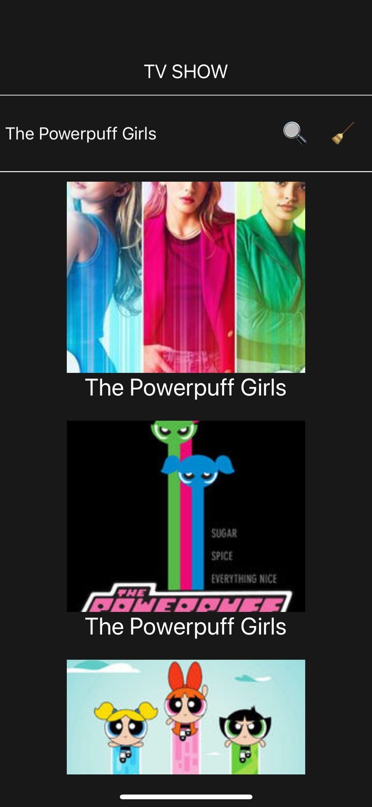
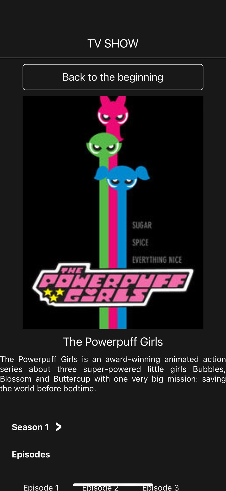
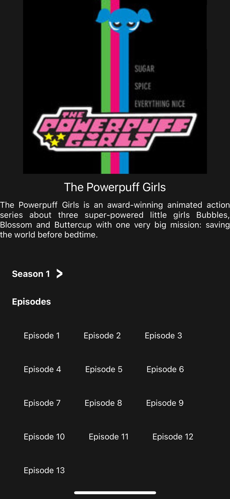
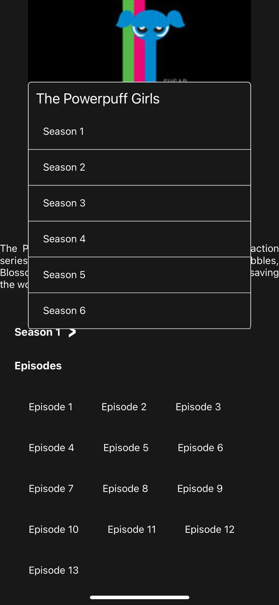
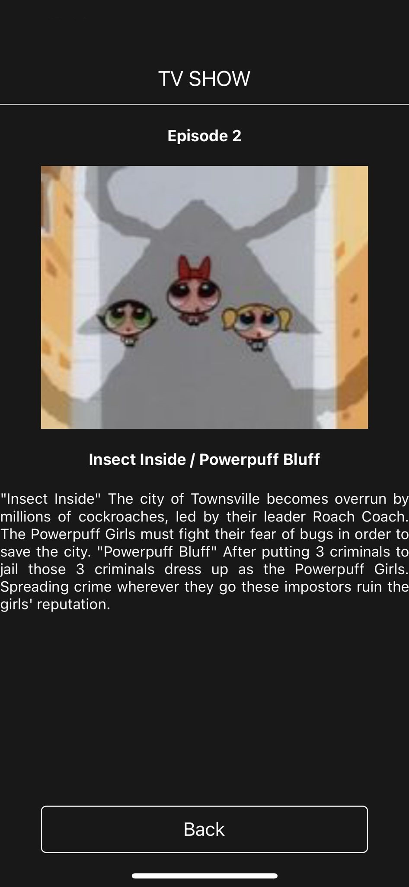

<h1 align="center">TV SHOW</h1>

The easier form to search your favorites shows.

Example:

Created using  
<a href="https://reactnative.dev">React Native</a> and 
<a href="https://docs.expo.dev">Expo</a> with
<a href="https://www.typescriptlang.org">TypeScript</a>
consuming <a href="https://www.tvmaze.com/api">TVMAZE API</a>

